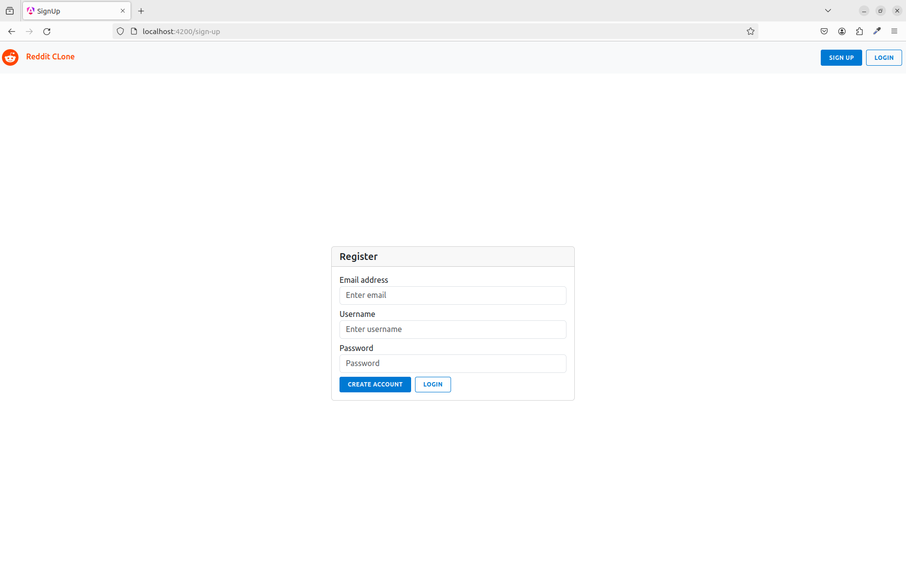
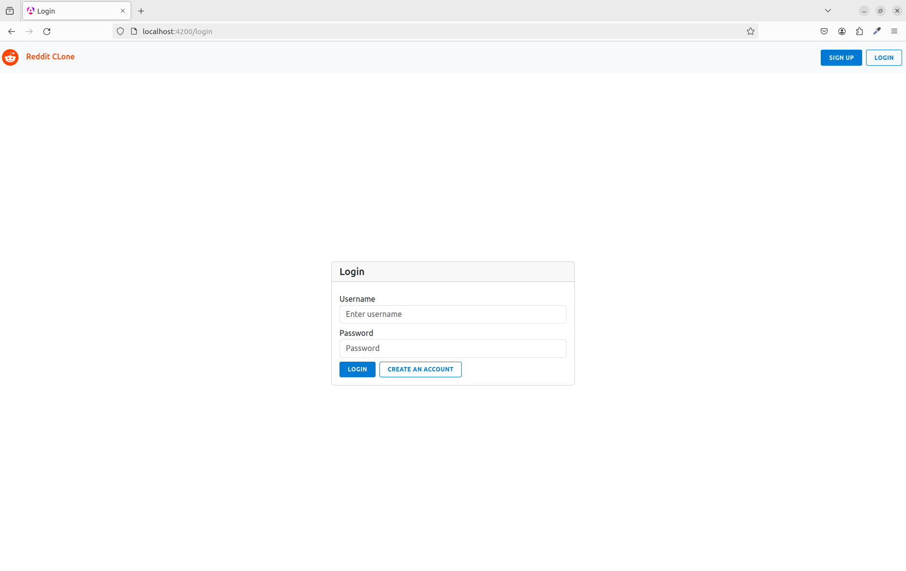
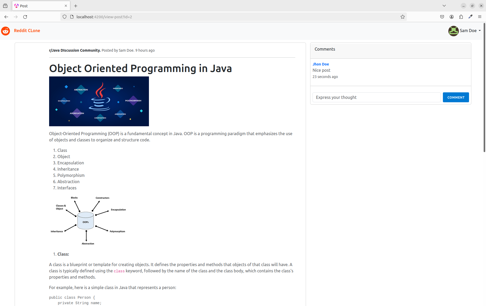
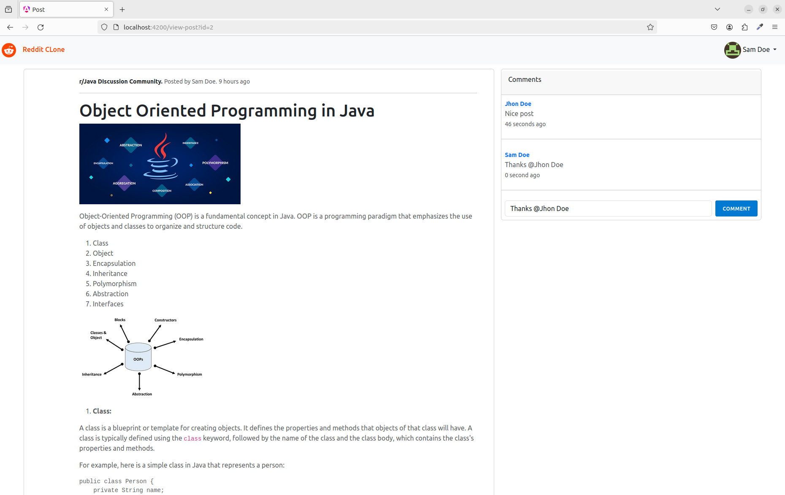
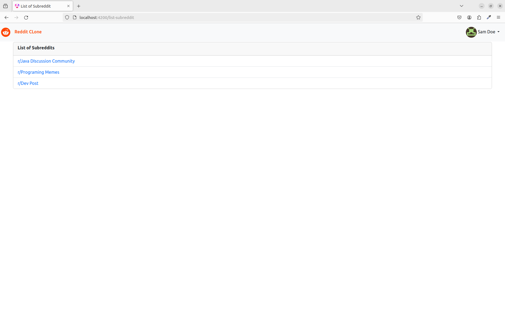
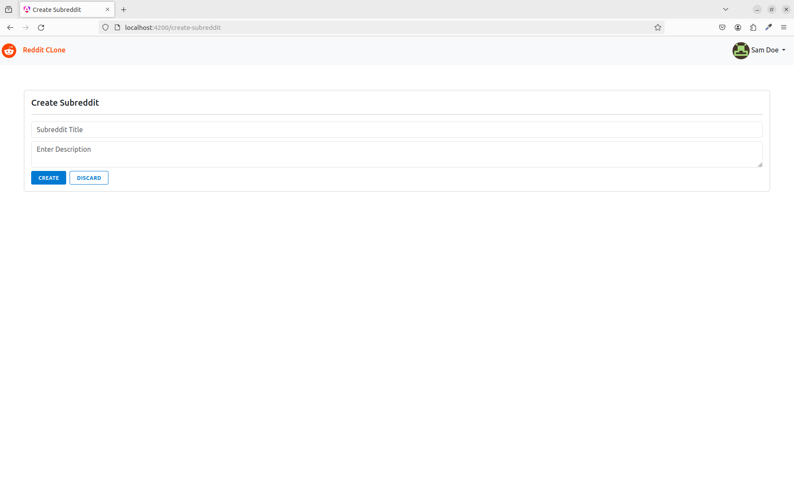
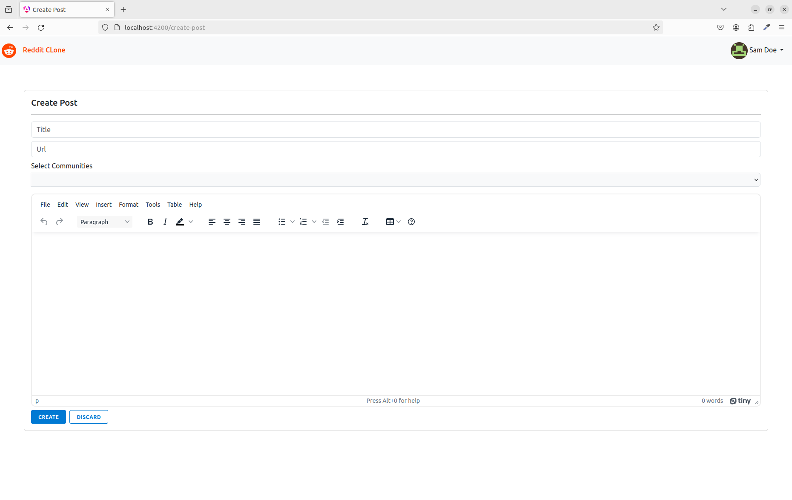
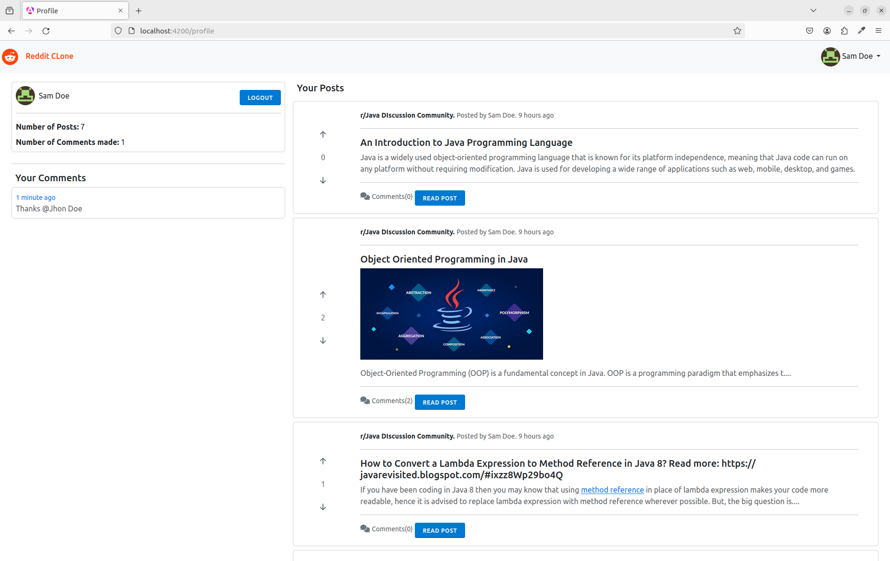

# reddit-clone

This project is a full-stack Reddit clone built with Spring Boot for the backend (API) and Angular for the frontend (client).

###  Key Features:

 - #### User Management:
   * Account creation with secure password hashing.
   * Login functionality with authentication.
   * User profiles for managing account details.
   
 - #### Content Management:
    * Post creation with text and image support.
    * Upvoting and downvoting system for posts and comments.
    * Commenting on posts to facilitate discussions.

 - #### Community Management:
    * Subreddit creation to categorize content.

### Technology Stack:

 - Backend (API): Spring Boot (Java)
 - Frontend (client): Angular (TypeScript)
 - Database: MySQL

### Project Structure:

```
reddit-clone/
├── image/
├── reddit-clone-api/  # Backend (Spring Boot) project (submodule)
│   └── ... (Spring Boot project files)
├── reddit-clone-client/  # Frontend (Angular) project (submodule)
│   └── ... (Angular project files)
└── ...  README.md  # This file
```

### Getting Started:

1. #### Prerequisites:
   - Java 17+ (or compatible version)
   - Node.js and npm (or yarn)
   - Git (for submodule management)
    
2. #### Clone the Repository:
   ```bash
    git clone https://github.com/ManishDait/reddit-clone.git
   ```

3. #### Initialize Submodules:
   ```bash
   cd reddit-clone
   git submodule inti && git submodule update
   ```

4. #### Set Up the Backend (API):

   - Refer to the reddit-clone-api/ project's documentation for api setup instructions. This will involve setting up a database connection, configuring Spring Boot properties, and building the project.

5. #### Set Up the Frontend (client):

    - Refer to the reddit-clone-client/ project's documentation for build and running client app. This will involve installing Angular dependencies, running build commands, and starting the development server.

### Result:
















